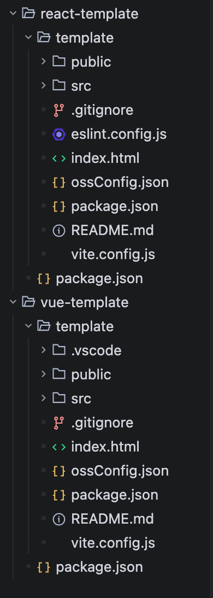

# 项目模版章节

## 为什么要有项目模版
在前端团队中，可能有多个前端项目，所以团队内应该沉淀出一个项目模版。创建新项目时，使用这套项目模版，避免项目五花八门。

## ttn-cli init 使用项目模版


## ttn-cli-template 目录结构
我只有两个项目模版，分别是 react-template 和 vue-template，那么 ttn-cli-template 目录结构如下：


- vue-template/package.json
```json
{
    "name": "@ttn-cli/vue-template",
    "version": "0.0.4",
    "description": "ttn-cli Vue3 模板",
    "files": [
        "template",
        "README.md"
    ],
    "publishConfig": {
        "access": "public"
    }
}
```
- vue-template/template/package.json
```json
{
  "name": "<%= projectName %>",
  "version": "0.0.1",
  "type": "module",
  "scripts": {
    "dev": "vite",
    "build": "vite build --mode production",
    "build:prod": "vite build --mode production",
    "build:pre": "vite build --mode preview",
    "preview": "vite preview"
  },
  "dependencies": {
    "vue": "^3.5.34"
  },
  "devDependencies": {
    "@vitejs/plugin-vue": "^6.0.6",
    "vite": "^8.0.12"
  }
}
```
当 vue / react 的项目模版更新之后，需要及时更新 vue-template/package.json 和 react-template/package.json 中的版本号。然后发布 npm 包。
发布之后，在 项目模版管理 页面更新，后续使用 ttn-cli 创建新项目时，即可使用最新的项目模版。

## 模版管理
当项目模版更新之后，需要及时在 项目模版管理 页面更新。
