# Markdown 扩展示例

此页面演示了 VitePress 提供的一些内置 markdown 扩展。

## 语法高亮

VitePress 提供由 [Shiki](https://github.com/shikijs/shiki) 提供支持的语法高亮，并具有额外的功能，如行高亮：

**输入**

````md
```js{4}
export default {
  data () {
    return {
      msg: 'Highlighted!'
    }
  }
}
```
````

**输出**

```js{4}
export default {
  data () {
    return {
      msg: 'Highlighted!'
    }
  }
}
```

## 自定义容器

**输入**

```md
::: info
这是一个信息框。
:::

::: tip
这是一个提示。
:::

::: warning
这是一个警告。
:::

::: danger
这是一个危险警告。
:::

::: details
这是一个详情块。
:::
```

**输出**

::: info
这是一个信息框。
:::

::: tip
这是一个提示。
:::

::: warning
这是一个警告。
:::

::: danger
这是一个危险警告。
:::

::: details
这是一个详情块。
:::

## Mermaid 图表

**输出**



```mermaid
flowchart TD

    A["开发者本地<br/>React18 + Vite 项目"] --> B["git push origin main"]

    B --> C["GitHub 仓库<br/>main 分支收到代码"]

    C --> D["GitHub Actions 触发<br/>deploy.yml"]

    subgraph GitHub_Actions["GitHub Actions CI/CD"]
        D --> E["actions/checkout<br/>检出代码"]

        E --> F["docker login<br/>登录阿里云镜像仓库"]

        F --> G["Docker Build<br/>执行 Dockerfile"]

        subgraph Docker_Build["Docker 多阶段构建"]
            G --> G1["builder 阶段<br/>node:20-alpine"]

            G1 --> G2["安装 pnpm"]
            G2 --> G3["pnpm install"]
            G3 --> G4["pnpm run build"]
            G4 --> G5["生成 dist 静态资源"]

            G5 --> G6["nginx:alpine 运行阶段"]
            G6 --> G7["复制 dist 到 nginx html 目录"]
            G7 --> G8["复制 nginx.conf"]
            G8 --> G9["生成最终生产镜像"]
        end

        G9 --> H["docker push<br/>推送镜像"]

    end

    H --> I["阿里云容器镜像服务 ACR"]

    I --> J["appleboy/ssh-action<br/>SSH 登录轻量服务器"]

    subgraph Server["阿里云轻量服务器"]
        J --> K["docker login<br/>服务器登录镜像仓库"]

        K --> L["创建 /app/simple-builder"]

        L --> M["生成 docker-compose.yml"]

        M --> N["docker pull<br/>拉取最新镜像"]

        N --> O["docker compose pull"]

        O --> P["docker compose up -d --force-recreate"]

        P --> Q["旧容器停止"]

        Q --> R["新容器启动"]

        R --> S["Nginx 容器运行"]

        S --> T["监听 80 端口"]

        T --> U["用户访问服务器 IP"]

        U --> V["Nginx 返回 React 静态资源"]

        V --> W["React18 SPA 运行"]

        P --> X["docker image prune -f<br/>清理旧镜像"]
    end

    style A fill:#dfefff
    style C fill:#fff2cc
    style D fill:#ffe599
    style I fill:#f4cccc
    style Server fill:#e2f0d9
```

## 更多

查看文档了解 [完整的 markdown 扩展列表](https://vitepress.dev/guide/markdown)。